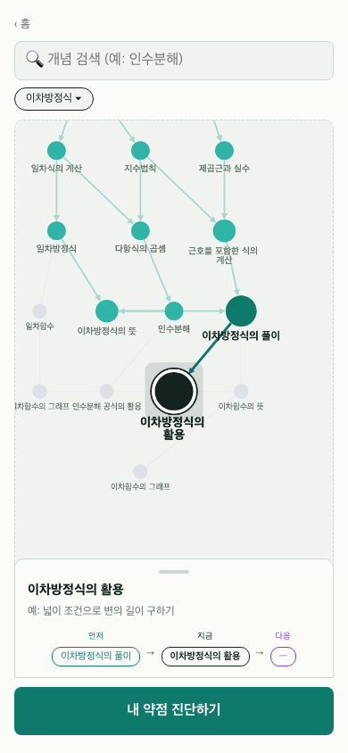
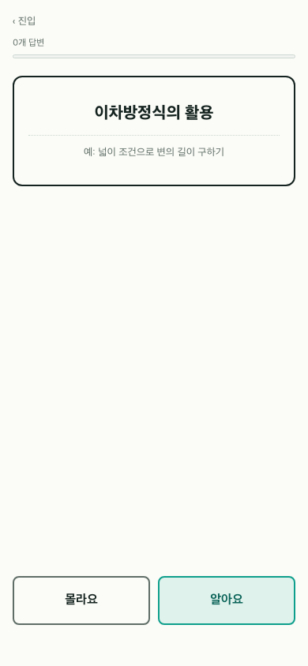
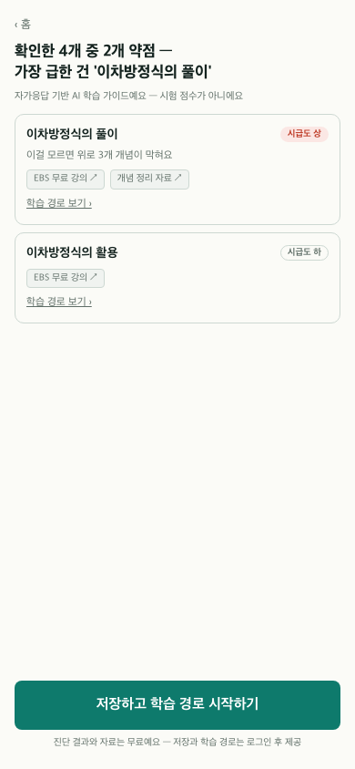
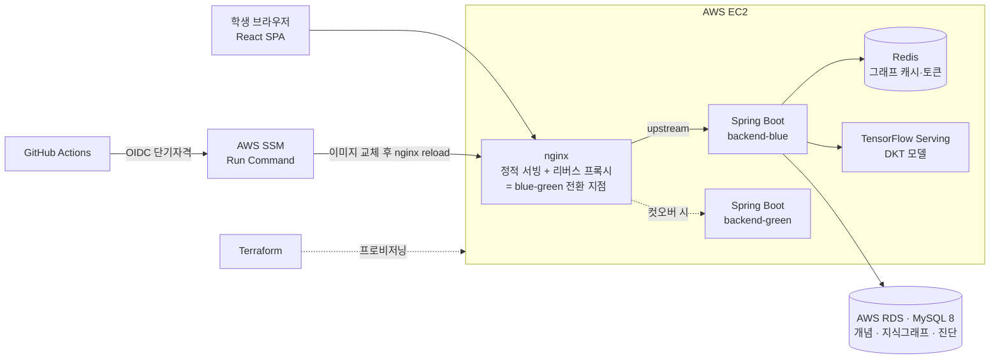
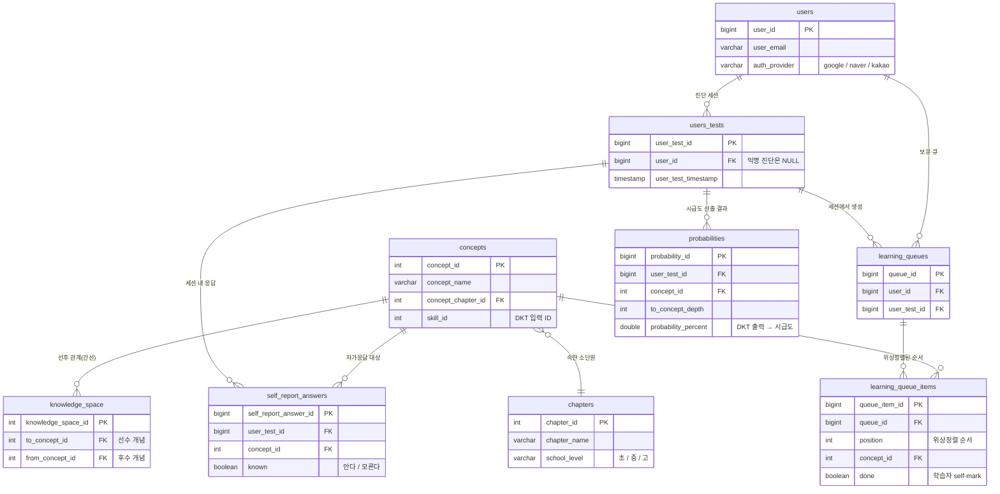

# My Math Teacher ( MMT )

수학 개념의 선후 위계를 그래프로 관리하고, 학생이 막힌 지점을 자가진단으로 짚어 다음에 무엇을 공부할지 안내하는 서비스.

**서비스 링크** : https://www.my-math-teacher.com  
**기간** : (v1) 2023.12 ~ 2024.07 · (v2) 2025.02 ~ 진행 중 &nbsp;|&nbsp; **개발 인원** : 1인 개발 &nbsp;|&nbsp; **백엔드** : Java 17 · Spring Boot 3.1.6 · MySQL 8

- **1,631개념 / 3,446간선 지식그래프**를 적응형 진단 엔진으로 사용 — 결정론적 KST 코어로 문항 선택 (ADR-0012)
- **그래프 DB를 단일 RDB로 통합** — Neo4j → MySQL 재귀 CTE, 깊이 3 탐색 p95 **14.034 ms → 0.556 ms**
- **재배포 중 요청 유실 60.3% → 0%** — 단일 EC2 위 blue-green, k6 부하 하에서 실측

---

## 기술 하이라이트

### 1. 적응형 자가진단 엔진 — 지식그래프를 테스트 엔진으로 (마일스톤 7, 2026-07)

저작권 문제로 진단에 쓸 문항을 확보할 수 없었다. 문제 풀이 대신 **개념 단위 "알아요/몰라요" 자가응답**으로 진단을 다시 설계하고, 지식그래프를 문항 은행 대신 **탐색 트리**로 사용했다. "몰라요"는 선수지식으로 내려가고, "알아요"는 그 아래 가지를 건너뛴다.

- **문항 선택 = 결정론적 KST 코어.** 후보 알고리즘을 조사한 뒤 **IRT·CAT·밴딧을 탈락**시켰다 — 실사용 응답 데이터가 없는 **콜드스타트**, 같은 입력에 같은 문항이 나와야 하는 **결정론** 요구, 세션 상태를 서버에 두지 않는 **stateless** 순회라는 3제약을 셋 다 만족하지 못했다. 채택안은 지식공간이론(KST) 기반 전역 반분 + DKT 역이용. → [ADR-0012](docs/adr/0012-adaptive-question-selection-deterministic-kst-core.md)
- **종료 조건과 순서를 규칙으로 분리.** 규칙 A(하한 K=8 / 상한 N=20 문항) · 규칙 B(`blockedDescendants` 내림차순 + 깊이 tie-break) · 규칙 C(`알아요` 폐쇄를 통째로 건너뛰지 않고 **되물어 확인**) 을 각각 별도 커밋으로 구현하고 **결정론 단위 테스트 12건**으로 고정.
- **기존 AI 모델을 버리지 않고 재활용.** v1의 DKT(TensorFlow Serving)를 폐기하는 대신 자가응답을 정오답으로 매핑(`안다=맞음`/`모른다=틀림`)해 시급도 산출에 그대로 입력. → [ADR-0010](docs/adr/0010-self-report-dkt-mapping-and-diagnosis-flag-namespace.md)
- **매핑이 실제로 변별하는지 실측.** 프로덕션과 동일 이미지로 대표 시나리오를 돌려 혼합 응답에서 **HIGH 21 / MID 21 변별**을 확인했고, 이 과정에서 **모델 출력(0~1)과 등급 컷(0~100) 의 스케일 단위 불일치**를 발견해 수정했다. → [실측 리포트](docs/benchmark/m7-r2-dkt-selfreport.md)
- **학습 경로는 위상정렬이 지배한다.** 여러 취약 개념의 공유 선수지식을 하나의 큐로 병합할 때, 시급도순으로 정렬하면 "3단 건너뛰고 5단부터" 가 되어 계단이 깨진다. Kahn 위상정렬을 지배 정렬로 두고 시급도는 **진입 우선순위**로만 사용, 그래프에 사이클이 있으면 degrade 처리.
- **쿼리 왕복 대신 인메모리 계산.** `blockedDescendants`는 이미 로드한 간선 위에서 깊이 3 역방향 BFS로 산출해, 요청마다 재귀 CTE를 다시 치지 않는다(§4.5 CTE와 동치).
- **전 구간 additive.** DDL 4건 모두 기존 테이블 무접촉, 신규 경로는 `mmt.diagnosis.enabled` 플래그 뒤 — 끄면 구 동작 그대로 복귀.

**핵심 의사결정 기록 (ADR):**
- [0012 — 적응형 문항 선택: 결정론적 KST 코어](docs/adr/0012-adaptive-question-selection-deterministic-kst-core.md) (IRT·밴딧 탈락 근거)
- [0010 — self-report → DKT 매핑 및 진단 플래그 네임스페이스](docs/adr/0010-self-report-dkt-mapping-and-diagnosis-flag-namespace.md)
- [0014 — `/error` 디스패치 permitAll](docs/adr/0014-error-dispatch-permitall-to-stop-401-masking.md) (프로덕션 500이 401로 마스킹되던 근본원인)

### 2. 그래프 데이터베이스를 단일 RDB로 통합 (마일스톤 2, 2026-05)

수학 개념의 선후 관계 그래프 탐색을 **Neo4j → MySQL 재귀 CTE**로 옮긴 마이그레이션. v1 시기 도입했던 그래프 DB가 1,631 노드 / 3,446 엣지 규모에서는 오히려 오버 엔지니어링이라 판단해 단일 RDB로 통합했다. (v1에서는 "그래프 도메인에는 그래프 DB" 라는 형태 매칭으로 골랐고, v2에서 실측으로 뒤집었다.)

- **응답 시간 p95 14.034 ms → 0.556 ms (약 25× 개선)** — 깊이 3 그래프 탐색 기준, warm-up 3회 + 측정 100회
- 결과 정확성·시각화 안전성·알고리즘 의미 보존을 **자동화 테스트로 검증** (회귀 15 케이스 + 성능 6 케이스 + DTO 안정성 4 케이스 + 거리 맵 의미 4 케이스)
- 데이터 중복 · 리액티브 안티패턴(`.block()`) · 인프라 복잡도를 **동시 해소**
- 피처 플래그 + 결과 스냅샷 비교 기반 **롤백 가능 마이그레이션**
- 작업 중 **알고리즘 함정**(옛 BFS 유틸의 path-order 가정 → CTE 결과와 비호환) 을 사전 발견해 silent regression 방지

**자세한 회고:** [docs/reports/m2-cte-migration.md](docs/reports/m2-cte-migration.md) (읽는 데 5~7 분)

**핵심 의사결정 기록 (ADR):**
- [0001 — 마이그레이션 전 테스트 커버리지 선행 구축](docs/adr/0001-test-coverage-before-migration.md) (정답지·롤백·피처 플래그 우선)
- [0003 — 캐싱 패턴: Spring Cache 추상화 미도입](docs/adr/0003-m2-caching-pattern.md) (사용처 5개 → 직접 호출이 더 명확)
- [0005 — CTE 객체 매핑 정책](docs/adr/0005-cte-object-mapping.md) (사용처 기반 정합화)

### 3. 배포 무중단화와 상시 운영 (마일스톤 4·6, 2026-07)

단일 EC2(t3.micro · 1 GiB) 위에서 Spring Boot 백엔드를 재배포할 때 발생하던 다운타임(502 · 요청 유실)을 **blue-green** 으로 제거. 쿠버네티스 · ECS · ALB 같은 큰 전환 없이 기존 프론트 nginx 를 전환 지점으로 재사용했다.

- **재배포 중 요청 유실 60.3% → 0%** — 부하(k6 constant-arrival-rate)를 계속 쏘며 배포. 측정 대상은 `permitAll` + DB 왕복이 있는 **대표 GET**(sub-ms `/health` 단독 측정은 드레인 경계의 502 를 못 드러내는 거짓 확신이라 배제). in-place 재배포 대조군 60.3% vs blue-green 502·transport_err **0**.
- **원자적 전환**: 신버전 health 통과 → `nginx -s reload` 로 upstream 을 한 번에 넘김 → 구버전 graceful drain(`server.shutdown=graceful`, 30s). "어느 순간에도 트래픽 받는 정상 백엔드 최소 1개"를 보장.
- **핵심 병목은 메모리가 아니라 CPU 였다** — 전환 구간 JVM 2개 공존 시 신버전 부팅이 1 vCPU 를 148%까지 점유해 구버전 응답이 밀림(blue-green 만으로도 컷오버에서 잔여 **11.4% 유실**). `docker run --cpus=0.5` 로 부팅 CPU 를 55%로 억제해 잔여 유실까지 제거(11.4% → **0%**).
- **배포 채널을 SSH-from-runner → AWS SSM Run Command** 로 전환 — 러너에 SSH 인바운드를 열지 않고 **GitHub OIDC 단기 자격**으로 배포(장기 AWS 키 폐기).
- **프로비저닝을 Terraform IaC 로** — EC2/RDS/EIP/SG 18 리소스를 `apply → 측정 → destroy` 사이클로 짧게 열고 닫음(크레딧 방어). 비가역 지점(계정·MFA·`apply`)만 사람 게이트, flip-back 판정도 사람 직감이 아닌 **유실 grader**(계측 게이트).
- **이 메커니즘을 상시 운영으로 소비(M6)** — 도메인 · TLS · OAuth 3사(Google/Naver/Kakao) 실등록 · AWS Budgets 비용 상한까지 붙여 공개 링크를 확보했다. 린 스택 기준 월 ~$37.

**결과:** [실측 리포트](docs/benchmark/milestone-4-run-report.md) · 시각 원페이저 [KO](docs/benchmark/milestone-4-zero-downtime-report-ko.html) / [EN](docs/benchmark/milestone-4-zero-downtime-report-eng.html)

**핵심 의사결정 기록 (ADR):**
- [0007 — blue-green 무중단 배포](docs/adr/0007-blue-green-zero-downtime-deployment.md) (프론트 nginx 재사용 · 원자적 reload · graceful drain)
- [0008 — 배포 채널 SSH → SSM Run Command](docs/adr/0008-m4-ci-deploy-channel-ssh-to-ssm-run-command.md) (러너 SSH 제거 · GitHub OIDC 단기 자격)
- [0013 — 프로덕션 배선을 프로파일 게이트 추적 설정으로 복구](docs/adr/0013-restore-production-wiring-as-profile-gated-tracked-config.md)

---

## 검증 방식

마이그레이션 전에 테스트를 먼저 깔고 시작한다는 원칙(ADR-0001)을 마일스톤 1에서 세우고 이후 계속 유지했다.

| 종류 | 도구·방식 | 용도 |
|---|---|---|
| 통합 테스트 | Testcontainers (MySQL 8 · Neo4j) | 실 DB 위에서 리포지토리·서비스 계층 검증 |
| 성능 기준선 | warm-up 3 + 측정 100회, p95/p99 | [마일스톤 1 기준선 리포트](docs/benchmark/milestone-1-baseline.md) — 마이그레이션 전후 비교의 정답지 |
| 결과 회귀 | 그래프 탐색 결과 sha256 스냅샷 | 구·신 경로의 결과 집합 동치성 (M2 전환 검증) |
| N+1 감지 | Hibernate `Statistics` API | 쿼리 수 회귀 방지 |
| 쿼리 시간 계측 | `QueryTimingAspect` + Micrometer | 슬로우 쿼리 WARN |
| 부하·무중단 | k6 `constant-arrival-rate` + `docker stats` | 재배포 중 유실률·CPU 경합 실측 (M4) |
| e2e | Playwright | 프론트 진단 완주 플로우 |

백엔드 테스트 클래스 38개. 결정론이 요구되는 문항 선택 로직은 **같은 입력에 같은 출력**을 단위 테스트로 고정했고, 실그래프(1,631개념)에 대한 라이브 검증도 함께 수행했다 — 이 라이브 검증이 단위 테스트가 못 잡는 **Spring DI 배선 실패**(생성자 다중 → 부팅 실패)를 잡아냈다.

---

## 서비스 소개

수학은 위계가 강한 학문이라 **이전 지식의 이해도가 다음 학습에 영향을 미친다.** 그래서 "지금 뭘 모르는가" 보다 **"어디서부터 무너졌는가"** 가 더 중요한 질문이 된다. MMT는 이 전제 위에 서 있다.

1. **선후 관계 그래프** — 개념 간 선수·후수 관계를 그래프로 탐색한다.
2. **자가진단** — 개념을 "알아요/몰라요"로 답하면, 그래프를 타고 내려가며 무너진 토대의 바닥을 찾는다. 문제를 풀지 않으므로 3분이면 끝난다.
3. **학습 경로** — 취약 개념을 시급도(DKT) 순으로 제시하고, 선수지식을 위상정렬한 **하나의 학습 큐**와 개념별 무료 학습자료 링크로 다음 행동을 연결한다.

| ① 선후 관계 그래프 | ② 자가진단 문답 | ③ 진단 결과 |
|:---:|:---:|:---:|
|  |  |  |
| 색 = 방향, 명도 = 거리 | 문제 풀이 없이 개념 단위 응답 | 시급도 등급 + 무료 자료 링크 |

> 모바일 퍼스트 설계라 390px 폭 기준 화면이다. 데모 데이터로 캡처했다.

제품 정의 정본: [`docs/prd/m7-prd.md`](docs/prd/m7-prd.md)

---

## 제품 판단 기록

1인 개발이라 범위 판단이 곧 생존이었다. 만들었다가 접은 것과 그 근거를 남긴다.

- **문제 풀이 진단 → 자가진단으로 피벗.** 저작권 때문에 진단용 문항을 확보할 수 없었다. 진단 기능을 포기하는 대신 self-report OX로 대체하고, 기존 DKT 모델은 정오답 매핑으로 재활용했다(위 하이라이트 1).
- **맞춤 학습지 폐기.** 조건부 출제·PDF 다운로드까지 구현해 출시했으나, 문항 자산 없이는 가치가 서지 않는다고 판단해 **그래프 학습 경로 + 외부 자료 링크**로 대체했다.
- **프론트 재작성(Vue → React).** 리디자인과 제품 피벗이 겹쳐 마이그레이션이 아니라 새로 그리는 편이 싸다고 판단. 구 `web/`은 롤백 자산으로 보존한다. → [ADR-0011](docs/adr/0011-react-web-v2-and-front-image-swap.md)
- **Neo4j 폐기는 단계로 나눴다.** 그래프 탐색 경로는 M2에서 CTE로 이전 완료(프로덕션도 CTE-only로 운영), 코드·인프라 실폐기는 M3로 분리해 아직 남겨뒀다.

전체 이력과 진행 상태: [`ROADMAP.md`](ROADMAP.md)

---

## 아키텍처 및 기술 스택

nginx의 upstream fragment 한 줄을 blue/green으로 재작성한 뒤 `nginx -s reload`로 넘기는 것이 전환의 전부다. 그래프 탐색은 MySQL 재귀 CTE로 처리하며, Neo4j는 이 경로에 없다.

### 기술 스택

| 분류 | 기술 |
|---|---|
| **Backend** | Java 17 · Spring Boot 3.1.6 · Spring Security + OAuth2 Client · JWT(jjwt) · JPA/Hibernate · JdbcTemplate(레거시, JPA 전환 중) · Gradle |
| **Database** | MySQL 8 (재귀 CTE 그래프 탐색 포함) · Redis · ~~Neo4j~~ *(M2에서 그래프 경로 이전 완료 · 코드·인프라 폐기는 M3)* |
| **AI** | TensorFlow Serving (DKT) |
| **Frontend** | React 19 · TypeScript · TanStack Query · Cytoscape(지식그래프 시각화) · Vite — `web-v2/`   *(v1·구 프론트: Vue 3 + PrimeVue — `web/`, 롤백 자산으로 보존)* |
| **Infra / DevOps** | AWS EC2 · RDS · EIP · Route 53 · Budgets · Let's Encrypt TLS · **Terraform(IaC)** · **AWS SSM Run Command + GitHub OIDC** · GitHub Actions · Docker · nginx |
| **테스트·계측** | Testcontainers · JUnit 5 · Hibernate Statistics(N+1) · Micrometer · k6 · Playwright |

---

## 데이터 모델

진단 도메인 핵심만 발췌. 전체 스키마(17개 테이블)는 [`api/sql/create.sql`](api/sql/create.sql) 참조.

`self_report_answers`는 구 `answers` 테이블을 건드리지 않는 **별도 테이블**이다 — 구 채점 경로를 전면 무변경으로 두기 위한 선택(ADR-0010).

---

## API

- [POSTMAN API 명세서](https://documenter.getpostman.com/view/28842793/2sAY4rE4aP) *(M7 자가진단 경로는 미반영)*

M7 자가진단 경로:

| 메서드 | 경로 | 용도 |
|---|---|---|
| `POST` | `/api/v1/diagnosis/frontier` | 시작 단원 → 진단 시작 프론티어 산출 |
| `POST` | `/api/v1/diagnosis/next` | 다음 문항 (규칙 A·B·C 적용, 결정론) |
| `POST` | `/api/v1/diagnosis/preview` | 로그인 전 결과 미리보기 (rate limit 10/분/IP) |
| `POST` | `/api/v1/diagnosis` | 결과 확정·계정 귀속 |
| `GET` | `/api/v1/diagnosis/{userTestId}` | 결과 조회 (소유자 외 403) |
| `POST` | `/api/v1/learning-queues` | 취약 개념 → 위상정렬 학습 큐 생성 |
| `GET` | `/api/v1/learning-queues/me` | 활성 큐 + 현재 위치 |
| `PATCH` | `/api/v1/learning-queues/{queueId}/items/{queueItemId}/done` | 항목 완료 표시 |

---

## 문서 지도

- [`ROADMAP.md`](ROADMAP.md) — 마일스톤 전체와 현재 상태 (정본)
- [`docs/adr/`](docs/adr/) — 의사결정 기록 14건
- [`docs/benchmark/`](docs/benchmark/) — 실측 리포트 (M1 기준선 · M4 무중단 런리포트 · M7 DKT 검증)
- [`docs/reports/`](docs/reports/) — 마이그레이션 회고 · 포스트모템
- [`docs/prd/`](docs/prd/) · [`docs/specs/`](docs/specs/) — 제품 요구사항 · 기술 스펙
- [`docs/DEVELOPMENT.md`](docs/DEVELOPMENT.md) — **로컬 개발 환경 셋업**

---

## 레퍼런스

- [AIHub 수학분야 학습자 역량 측정 데이터](https://aihub.or.kr/aihubdata/data/view.do?currMenu=115&topMenu=100&aihubDataSe=realm&dataSetSn=133) — DKT 모델 학습에 사용
