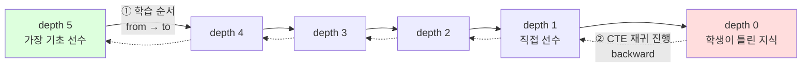

# ADR 0003: knowledge_space 엣지 방향성 — (from, to) = (선수, 후수), CTE는 backward 방향

## Status

Accepted

## Context

Milestone 2(Neo4j → MySQL CTE 마이그레이션) 사전 audit 과정에서 그래프 탐색 쿼리를 MySQL Recursive CTE로 옮길 때 JOIN 방향이 결정적임이 확인되었다. spec-01 1차 작성에서는 `MATCH (n)-[r]->(m{conceptId})`의 `n`이 "선수 개념"이라는 가정을 사용했으나, `select.sql:285`의 CTE 프로토타입은 forward(`from→to`) 방향으로 작성되어 있어 마일스톤 의도와 충돌하는지 모호했다. 추가로 spec-01 본문의 쿼리 1(backward)과 쿼리 2(forward)가 서로 반대 방향이라 spec 내부 정합성도 깨진 상태였다.

본 ADR은 `knowledge_space` 테이블의 `from_concept_id`·`to_concept_id` 의미를 확정하고, M2 CTE의 JOIN 방향을 단일안으로 고정한다.

## Decision

`knowledge_space (from_concept_id, to_concept_id)` 의미를 다음으로 확정한다:

- `from_concept_id` = **선수 개념** (이전에 학습되어야 하는 개념)
- `to_concept_id` = **후속 개념** (선수가 충족된 후 학습하는 개념)
- 화살표 의미: `from → to` = "선수 → 후수" 방향

이에 따라 M2의 모든 CTE 쿼리는 **backward** 방향(엣지의 `from → to` 화살표를 거슬러 따라가는 방향)으로 작성한다.

- **시작 노드** = 학생이 틀린 지식 (depth 0)
- **매 재귀 단계** = 현재 노드를 후수 위치(`ks.to_concept_id`)로 잡고, 그 엣지의 선수(`ks.from_concept_id`)를 다음 노드로 가져옴
- **결과** = 시작 노드에서 한 단계씩 선수 쪽으로 거슬러 올라가, depth N단계까지의 모든 선수 개념이 누적



실선(①) = `knowledge_space` 엣지의 본래 방향(선수 → 후수, 학습 시간순). 점선(②) = CTE가 재귀로 따라가는 방향(시작 노드에서 선수 쪽으로 거슬러 올라감).

깊이 1 (직접 선수):
```sql
SELECT c.* FROM concepts c
JOIN knowledge_space ks ON c.concept_id = ks.from_concept_id
WHERE ks.to_concept_id = ?
```

깊이 N 재귀 (선수 N단계):
```sql
WITH RECURSIVE prerequisite_path AS (
    SELECT concept_id, 0 AS depth
    FROM concepts WHERE concept_id = ?

    UNION ALL

    SELECT c.concept_id, pp.depth + 1
    FROM prerequisite_path pp
    JOIN knowledge_space ks ON pp.concept_id = ks.to_concept_id
    JOIN concepts c           ON ks.from_concept_id = c.concept_id
    WHERE pp.depth < ?
)
SELECT DISTINCT concept_id FROM prerequisite_path;
```

`select.sql:285`의 forward 프로토타입은 마일스톤 의도와 다른 구버전이므로 폐기 처리한다.

## Consequences

### Positive
- spec-01·02·03 전반에 걸쳐 방향성이 단일 결정으로 통일되어 spec 실행 시 결정 부담 사라짐
- M1의 `findToConceptsByConceptId`("선수 개념 조회 — 들어오는 엣지" 의미)와 M2 CTE 의미가 일치하여 회귀 비교가 단순
- ConceptService.findToConcepts → spec-01 깊이 1 쿼리(`findPrerequisiteConceptIds(?, 1)`)와 동일 의미가 되어 별도 outgoing CTE 메서드 도입 불필요

### Negative
- `select.sql:285` 프로토타입을 폐기 처리해야 함 (재사용 불가)

### Neutral
- 시드 데이터 의미가 변경되는 것은 아님 — 기존 코드의 해석을 명문화한 것

## Alternatives Considered

1. **forward 방향 (`select.sql:285` 프로토타입 그대로 채택)** — 기각. 마일스톤 의도(진단 결과 페이지의 선수 개념 그래프 표시)와 의미 반대. 채택 시 M1 `findToConceptsByConceptId` 결과와 CTE 결과가 다르게 되어 회귀 검증 자체가 무의미.
2. **방향성 결정을 spec-01 실행 시점으로 미루기** — 기각. spec-01·02 전반의 코드 예시·테스트 케이스가 방향에 의존하므로 spec 실행 중 결정하면 광범위한 재작성 발생.

## References

- 근거 1 — `api/sql/insert_knowledge_space.sql` 시드 데이터 (예: `(1, 4659, 3)`에서 `to=4659`, `from=3` — 작은 ID(기초)가 from, 큰 ID(파생)가 to)
- 근거 2 — `docs/benchmark/milestone-1-baseline.md:56` ("선수 개념 조회 (들어오는 엣지)") — M1 작성자의 명시 정의
- 적용 spec: `docs/specs/m2/spec-01-cte-repository-and-indexes.md`, `docs/specs/m2/spec-02-service-integration-and-caching.md`
- 폐기 자료: `api/sql/select.sql:285` (forward CTE 프로토타입)
- 관련 ADR: ADR 0002 §2 (테스트 프로파일)
