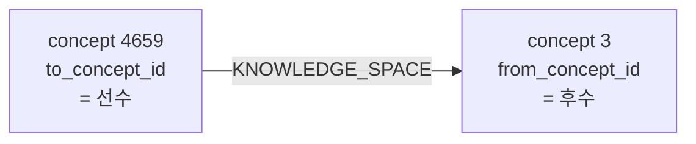

# Spec 01: CTE 리포지토리 + 인덱스

**상위 마일스톤:** Milestone 2 (Neo4j → MySQL CTE 마이그레이션)
**대상 Phase:** Phase 1
**예상 소요:** 2일
**선행 spec:** —

---

## 범위

`JdbcTemplateConceptRepository`에 재귀 CTE 메서드를 추가하고, 성능 확보에 필요한 인덱스를 도입한다. 본 spec은 **데이터 레이어에 한정**되며, 서비스 레이어 통합·피처 플래그 분기·캐싱은 spec-02, 검증·출시·폐기는 spec-03 범위다.

---

## 📌 데이터 모델 노트 — `knowledge_space` 엣지 방향성

> **본 노트는 M2 전 spec(01·02·03)의 모든 SQL과 테스트 단정에 적용되는 의미 정의다. SQL 작성·해석 시 항상 이 노트를 기준으로 한다.**

### 컬럼 의미 (코드와 시드로부터 도출됨, 결정이 아닌 사실)

| 컬럼 | 의미 |
|---|---|
| `from_concept_id` | **후수** (해당 엣지에서 학습 시간상 뒤에 오는 개념) |
| `to_concept_id` | **선수** (해당 엣지에서 학습 시간상 앞서야 하는 개념) |

### 근거 1 — Neo4j 적재 코드

`api/src/test/java/com/mmt/api/performance/GraphQueryPerformanceTest.java`의 `LOAD CSV`:

```cypher
LOAD CSV WITH HEADERS FROM 'file:///knowledge_space.csv' AS row
MATCH (a:concept {concept_id: toInteger(row.to_concept_id)}),
      (b:concept {concept_id: toInteger(row.from_concept_id)})
CREATE (a)-[:KNOWLEDGE_SPACE]->(b)
```

엣지는 **`to_concept_id 노드 → from_concept_id 노드`** 방향으로 생성된다. 즉 그래프 화살표의 방향과 컬럼 이름의 방향이 정반대.

### 근거 2 — Cypher 쿼리 의미

`ConceptRepository.findToConceptsByConceptId`:

```cypher
MATCH (n)-[r]->(m{concept_id: $conceptId}) RETURN (n)
```

`m`으로 들어오는 엣지의 시작점 `n`을 반환. M1 baseline 작성자가 이를 "선수 개념 조회 (들어오는 엣지)"로 명시 정의(`docs/benchmark/milestone-1-baseline.md:56`).

위 두 근거를 결합:
- 그래프 엣지: `to_id_node → from_id_node`
- "들어오는 엣지의 시작점 = 선수" → 그래프에서 화살표가 출발하는 쪽이 선수
- 따라서 **`to_concept_id` = 선수**, **`from_concept_id` = 후수**

### Trace — 시드 한 행으로 의미 검증

시드 `(id=1, to_concept_id=4659, from_concept_id=3)`:



- Cypher `MATCH (n)-[r]->(m{concept_id: 3}) RETURN n` → `[4659]` (concept 3의 선수)
- 의미: "concept 3을 학습하기 전에 concept 4659를 먼저 학습해야 한다"

### MySQL CTE에의 적용

"X의 선수를 N단계까지 거슬러 올라가기" 쿼리:
- 시작 노드의 `concept_id`를 **현재 노드 = 후수** 위치로 잡음 → `pp.concept_id = ks.from_concept_id`
- 다음 단계로 **선수**(`ks.to_concept_id`)를 가져옴

```sql
JOIN knowledge_space ks ON pp.concept_id = ks.from_concept_id  -- 현재=후수
JOIN concepts        c  ON ks.to_concept_id = c.concept_id     -- 다음=선수
```

이 JOIN 패턴은 spec-01·02·03의 모든 CTE와 ADR 0005의 객체 반환 SQL 예시에 동일하게 적용된다.

---

## 사전 조건 / 검증 필요

- ✓ `api/sql/select.sql:285`에 CTE 프로토타입 실재 확인 (`WITH RECURSIVE path AS ...`, conceptId=4979 하드코딩). 본 spec의 출발점.
- ✓ `JdbcTemplateConceptRepository` 위치: `api/src/main/java/com/mmt/api/repository/concept/JdbcTemplateConceptRepository.java`. 그래프 메서드는 부재. 기존 메서드 명명 패턴은 `find{무엇}By{기준}` (예: `findOneByConceptId`, `findAllByChapterId`, `findSchoolLevelByConceptId`, `findSkillIdByConceptId`). 본 spec에서 신규 도입할 메서드도 동일 패턴을 따른다.
- ✓ 스키마 확인 (`api/sql/create.sql:52-58`): `knowledge_space(knowledge_space_id INT PK, to_concept_id INT FK, from_concept_id INT FK)`. `concepts.concept_id`도 INT.
- ✓ DB 마이그레이션 도구 미도입 — `api/sql/`의 수동 SQL 스크립트로 관리(DDL은 `create.sql`, 시드는 `insert_*.sql`). 본 spec의 인덱스 추가·`cte_max_recursion_depth` 설정은 (A) `api/sql/`에 신규 스크립트로 추가하거나 (B) Hikari `connection-init-sql`로 적용.

### ConceptService ↔ ConceptRepository ↔ CTE 매핑 표

ConceptService(5개 그래프 메서드)와 ConceptRepository(6개 Cypher 그래프 메서드)의 매핑. 본 spec(spec-01)은 **ID 반환 메서드 한정**이고, 객체 반환은 spec-02에서 ADR 0005의 JOIN 패턴으로 처리:

| ConceptService (5) | ConceptRepository (6) | 깊이 | 반환 타입 | 처리 spec |
|---|---|---|---|---|
| `findNodesByConceptId` (초등) | `findNodesByConceptIdDepth3` | 3 | `Flux<Concept>` | spec-02 (ADR 0005) |
| `findNodesByConceptId` (그 외) | `findNodesByConceptIdDepth5` | 5 | `Flux<Concept>` | spec-02 (ADR 0005) |
| `findNodesIdByConceptIdDepth2` | `findNodesIdByConceptIdDepth2` | 2 | `Flux<Integer>` | **spec-01** — `findPrerequisiteConceptIds(?, 2)` |
| `findNodesIdByConceptIdDepth3` | `findNodesIdByConceptIdDepth3` | 3 | `Flux<Integer>` | **spec-01** — `findPrerequisiteConceptIds(?, 3)` |
| `findNodesIdByConceptIdDepth5` | `findNodesIdByConceptIdDepth5` | 5 | `Flux<Integer>` | **spec-01** — `findPrerequisiteConceptIds(?, 5)` |
| `findToConcepts` | `findToConceptsByConceptId` | 1 | `Flux<Concept>` | spec-02 (ADR 0005, 깊이 1 == 직접 선수) |

본 spec은 위 매핑 중 **ID 반환 3 row**에 대응하는 단일 CTE 메서드를 도입한다:
- `findPrerequisiteConceptIds(int conceptId, int maxDepth)` — `List<Integer>` 반환

객체 반환 메서드(`findPrerequisiteConcepts`) + `RowMapper<Concept>` 매핑은 spec-02에서 ADR 0005의 `concepts JOIN chapters` 패턴으로 처리.

---

## Task 1.1 — 재귀 CTE 메서드 도입

> JOIN 방향은 위 [데이터 모델 노트](#-데이터-모델-노트--knowledge_space-엣지-방향성) 의미 정의를 따른다. `from_concept_id`=후수, `to_concept_id`=선수.

### Neo4j 쿼리 3종 → MySQL CTE 매핑

`api/sql/select.sql:285`의 CTE 프로토타입을 기반으로 깊이 매개변수만 변수화하여 통합 메서드 형태로 정착시킨다.

**쿼리 1 — 직접 선수 개념 (depth 1)**

Neo4j 원본:
```cypher
MATCH (n)-[r]->(m{concept_id: $conceptId}) RETURN (n)
```

MySQL 변환 (X의 직접 선수: `from=X`인 행의 `to`):
```sql
SELECT c.* FROM concepts c
JOIN knowledge_space ks ON c.concept_id = ks.to_concept_id
WHERE ks.from_concept_id = ?
```

**쿼리 2 — 깊이 N 재귀 탐색 (핵심)**

Neo4j 원본:
```cypher
MATCH (n)-[*0..N]->(m {concept_id: $conceptId}) RETURN (n)
```

MySQL 변환 (시작 노드를 후수로 잡고, 선수 방향으로 N단계 거슬러 올라감):
```sql
WITH RECURSIVE prerequisite_path AS (
    SELECT concept_id, 0 AS depth
    FROM concepts WHERE concept_id = ?

    UNION ALL

    SELECT c.concept_id, pp.depth + 1
    FROM prerequisite_path pp
    JOIN knowledge_space ks ON pp.concept_id = ks.from_concept_id  -- 현재=후수
    JOIN concepts c           ON ks.to_concept_id = c.concept_id   -- 다음=선수
    WHERE pp.depth < ?
)
SELECT DISTINCT concept_id FROM prerequisite_path
```

쿼리 1은 쿼리 2의 `maxDepth=1` 호출과 동일 결과이므로 **별도 메서드 불필요** — `findPrerequisiteConceptIds(?, 1)` 또는 `findPrerequisiteConcepts(?, 1)` 호출로 처리한다.

**쿼리 3 — 경로 상의 concept_id 추출 (BFS 입력용)**

쿼리 2와 동일한 결과셋. 별도 메서드를 두지 않고 쿼리 2 결과를 BFS 입력으로 그대로 사용.

### 메서드 시그니처

`MysqlConceptRepository`(M1 도입)는 이미 다음 메서드를 인터페이스에 정의해두었다:

```java
public List<Integer> findPrerequisiteConceptIds(int conceptId, int maxDepth);
```

본 spec은 이 메서드의 **실제 CTE 구현**을 작성한다. 현재 `MysqlConceptRepositoryStub`이 `UnsupportedOperationException`을 던지는 형태로 등록되어 있으니 이를 신규 구현 클래스로 대체한다.

객체 반환 메서드(`findPrerequisiteConcepts`)는 spec-02에서 ADR 0005의 `concepts JOIN chapters` 패턴으로 추가한다.

---

## Task 1.2 — 편의 메서드 도입 결정 (변경됨: 미도입)

기존 Neo4j 쪽이 `findNodesIdByConceptIdDepth2/3/5`로 분리된 이유는 Cypher의 깊이 매개변수가 리터럴만 허용하기 때문. CTE는 매개변수화 가능하므로 통합 메서드 하나로 충분하다.

**결정: 편의 메서드 미도입.** M1 시범 분기 패턴(`ConceptService.java:73-80`)이 통합 메서드 + 깊이 인자 형태 `findPrerequisiteConceptIds(conceptId, 3)`를 채택했으므로, 본 spec도 통합 메서드만 도입하여 spec-02의 분기 적용과 정합성을 유지한다.

호출부 사용 깊이 확인 결과: 2/3/5 세 가지만 사용 (그 외 값 없음). 통합 메서드의 `maxDepth` 인자로 모두 처리 가능.

---

## Task 1.3 — 인덱스 도입

```sql
CREATE INDEX idx_knowledge_space_from ON knowledge_space(from_concept_id);
CREATE INDEX idx_knowledge_space_to   ON knowledge_space(to_concept_id);
CREATE INDEX idx_knowledge_space_composite
    ON knowledge_space(from_concept_id, to_concept_id);
```

[검증 필요]
- 위 인덱스 또는 동등 인덱스가 이미 존재하는지: `SHOW INDEX FROM knowledge_space`
- PRIMARY KEY 또는 UNIQUE 제약이 동일 컬럼 조합을 커버하는지
- 참고: `create.sql:52-58`의 `knowledge_space`는 `PRIMARY KEY(knowledge_space_id)` + FK 2개만 명시. MySQL은 FK 컬럼에 자동 인덱스를 생성하므로 단일 인덱스 2개(`from_concept_id`, `to_concept_id`)는 사실상 이미 존재할 가능성이 높음 → **신규는 복합 인덱스 1개일 가능성**. `SHOW INDEX`로 중복 회피 후 결정.
- 적용 위치: 마이그레이션 도구 미도입(사전 조건 참조) → `api/sql/`에 신규 SQL 스크립트(예: `add_knowledge_space_indexes.sql`)로 추가하고 PR에 적용 절차 명시.

`EXPLAIN`으로 쿼리 2의 실행 계획에서 재귀 단계마다 `idx_knowledge_space_from`이 사용되는지 확인.

---

## Task 1.4 — 재귀 깊이 설정

MySQL 기본값 `cte_max_recursion_depth = 1000`은 충분하지만, 안전상 명시적 설정 권장:

```sql
SET SESSION cte_max_recursion_depth = 10;
```

최대 깊이 5에 충분하며, 데이터 이상 시 무한 루프를 빠르게 차단.

[검증 필요] 적용 위치 결정:
- (A) Hikari `connection-init-sql` (`spring.datasource.hikari.connection-init-sql`)
- (B) 마이그레이션 스크립트의 GLOBAL 설정
- (C) 메서드 호출 시점에 `JdbcTemplate.execute("SET SESSION ...")`

(A)가 가장 안전 (모든 커넥션 적용, 운영 측 영향 없음).

---

## Task 1.5 — 단위 테스트

테스트 위치: `api/src/test/java/com/mmt/api/repository/concept/MysqlConceptRepositoryCteTest.java`
사용 인프라: M1의 Testcontainers MySQL + `application-test.yml` (ADR 0002 §2)

테스트 케이스 (`findPrerequisiteConceptIds` 한정):

- 단일 conceptId, depth 0 → 자기 자신 1개만 반환
- depth 1 → 직접 선수 개념만 (자기 자신 포함)
- depth N → N 단계 이내 모든 선수 개념
- 존재하지 않는 conceptId → 빈 리스트
- 깊이 매개변수가 음수 → IllegalArgumentException 또는 빈 리스트 (정책 결정 필요)
- 다중 경로(같은 conceptId가 여러 깊이로 도달 가능) → DISTINCT로 중복 제거됨

[검증 필요] 데이터에 순환 참조 존재 여부. 존재한다면 CTE는 `cte_max_recursion_depth`에 도달할 때까지 무한히 노드를 누적하므로 정확성 검증 케이스 추가 필수.

객체 반환 메서드(`findPrerequisiteConcepts`)의 단위 테스트는 spec-02에서 추가.

---

## Task 1.6 — (이전: Concept 엔티티 매핑) — spec-02로 이전됨

본 task는 객체 반환 메서드(`findPrerequisiteConcepts`)를 위한 `RowMapper<Concept>` 도입을 다뤘으나, 본 spec은 ID 반환 한정이므로 **spec-02로 이전**한다.

매핑 정책은 ADR 0005(`concepts JOIN chapters` 패턴, conceptSection 매핑 생략, `Concept` 어노테이션은 spec-03 Task 5.3에서 일괄 정리)으로 확정. spec-02 Task 3.1에서 ConceptResponse 변환 분기와 함께 도입.

---

## 참조 데이터

테스트는 M1에서 확보한 결과 스냅샷(`shared/benchmark/`)과 정확성 검증을 spec-03에서 수행한다. 본 spec의 단위 테스트는 격리된 작은 데이터셋을 사용한다.

테스트 시드: 운영 시드(`api/sql/insert_chapters.sql`, `insert_concepts_escape.sql`, `insert_knowledge_space.sql`)를 격리된 테스트 스키마(`api/src/test/resources/sql/cte_snapshot_test_schema.sql` — Task 1.5 산출물)와 함께 재활용. M2 spec-03 회귀 테스트와 시드 출처를 일치시켜 결과 동등성을 보장.

---

## 완료 기준

- [ ] CTE 통합 메서드 1개 도입: `findPrerequisiteConceptIds(int, int)` — Stub을 실제 구현으로 대체 (편의 메서드 미도입 — Task 1.2)
- [ ] 인덱스 3종 적용 (또는 기존재 시 검증 결과를 PR 설명에 명시)
- [ ] `cte_max_recursion_depth` 설정 적용 위치 결정 및 반영
- [ ] 단위 테스트 모두 통과 (Testcontainers 기반, ID 반환 메서드 한정)
- [ ] 기존 `ConceptServiceFeatureFlagTest` 갱신 (Stub의 `UnsupportedOperationException` 검증을 실제 구현 동작 검증으로)
- [ ] `EXPLAIN` 결과 PR 설명에 첨부
- [ ] PR 설명에 ADR 0002 §3(Hibernate Statistics는 JPA 한정 — 본 spec은 JdbcTemplate이므로 비대상) 명시
- [ ] Analyze-Before-Change 결과(영향받는 호출부, 롤백 시나리오) PR 설명 포함

---

## 비범위 (다른 spec에서 처리)

- 객체 반환 그래프 메서드(`findNodesByConceptId`, `findToConcepts` 등) → spec-02 (ADR 0005의 `concepts JOIN chapters` 매핑 패턴 적용)
- `RowMapper<Concept>` 도입 → spec-02
- ConceptService 통합 → spec-02
- 캐싱 적용 → spec-02
- 피처 플래그 분기 → spec-02
- 정확성 검증 (M1 스냅샷 대비) → spec-03
- 성능 측정 → spec-03
